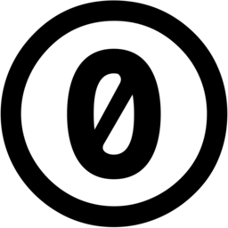
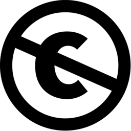

# 한번 보면 계속 보게 되는 디자인 관련 정보


## 2020 디자인 트렌드

```
어차피 디자인 체험하기라 트렌드까지 맞춰가며 디자인을 할 필요는 절대절대 없으나, 궁금하다면 한번쯤 보는건 나쁘지 않습니다.
```


#### [2020 그래픽 디자인 트렌드](https://brunch.co.kr/@thewatermelon/87)

#### [팬톤 2020 올해의 컬러](https://post.naver.com/viewer/postView.nhn?volumeNo=27020155&memberNo=856760)


---


## 저작권

```
창작물과 저작권을 땔래야 땔 수 없는 관계입니다. 사진은 기본이고, 아이콘, 심지어 폰트까지 다 저작권으로 보호받고 있습니다.
저작권의 종류로는 정말정말 많은 종류들이 있지만, 이 문서에서는 해당 내용을 자세하게는 다루지 않습니다.
그냥 간단하게 '저작권란에 아래 사진과 똑같은 마크가 있는 작품'이나, '하단 본문에 제가 설명한 내용'만 따라하시면 됩니다.
(아래 사진은 CC0, CC Public 으로, '상업적으로 별도의 표기 없이 사용 가능한 작품을 의미'합니다)
```

<center></center>

<center></center>


---


## 아이콘 다운로드 사이트

```
원하는 아이콘이 있는데, 만들기는 어렵고 찾기는 힘들고....
걱정하지 마세요! 아래 5곳의 사이트 중 2~3곳만 기억하고 있어도 정확하게 원하는 아이콘을 찾을 수 있습니다.
```


### 1. [flaticon](https://www.flaticon.com/)

```
특징
- 프리미엄이 아니라면, 상업적으로 사용할때 저작권 표기가 꼭 필요하다.
- 로그인이 필수가 아지만, 회원가입을 권장한다. (미가입자는 하루에 최대 10개까지 다운 가능, 가입하면 하루 최대 100개)
- 자료의 양이 많아 원하는 사진을 빠르게 찾을 수 있다.
- 영문 검색만 가능하다.
- 원하는 사이즈로 다운로드가 가능하다.
- 원하는 색으로 재도포가 가능하다.
- 아래 설명한 freepik과 같은 회사가 운영하는 사이트.
```


### 2. [ICONFINDER](https://www.iconfinder.com/)

```
특징
- 각 아이콘마다 저작권이 다른데(MIT, OFL 등) 이는 필터링으로 해결이 가능하다.
- 로그인이 필수가 아니다.
- 자료의 양이 많아 원하는 사진을 금방 쉽게 찾을 수 있다.
- 영문 검색만 가능하다.
- 원하는 사이즈로 다운로드가 가능하다.
```


### 3. [MATERIAL ICON](https://material.io/resources/icons/?style=baseline)

```
특징
- 아파치 라이센스 2.0으로 보호되고 있다. (아이콘 판매만 빼면 모든 짓을 해도 상관이 없다)
- 로그인이 필요 없다.
- 적당한 양의 자료들이 있다.
- 영문 검색만 가능하다.
- 원하는 사이즈로 다운로드가 가능하다.
- Filled, Outlined, Rounded, Two-Tone, Sharp 중 원하는걸 선택하여 다운로드가 가능하다.
- SVG와 PNG 중 원하는 포맷을 선택하여 다운로드가 가능하다.
```


### 4. [iconmonstr](https://iconmonstr.com/)

```
특징
- 비하, 모욕, 차별 등의 창작물과 로고, 트레이드 마크에는 사용이 불가능하다.
- 저작권 표기 없이 상업적 사용이 가능하다.
- 로그인이 필요 없다.
- 자료의 양이 비교적 많아 원하는 사진을 금방 찾을 수 있다.
- 영문 검색만 가능하다.
- 원하는 사이즈로 다운로드가 가능하다.
- Fill, Bold, Thin 중 원하는걸 선택하여 다운로드가 가능하다.
```


### 5. [icooon mono](https://icooon-mono.com/?lang=en)

```
특징
- 로고, 트레이드 마크에는 사용이 불가능하다.
- 저작권 표기 없이 상업적 사용이 가능하다.
- 로그인이 필요 없다.
- 원하는 색상으로 재도포가 가능하다.
- 원하는 사이즈로 다운로드가 가능하다.
- 이시국 사이트.
```


---


## 사진 다운로드 사이트

```
내 디자인에 어울리는 사진... 찾기 힘드셨나요? 이젠 아래 사이트에서 한번에 찾아보세요!
아이콘과 마찬가지로 2~3곳만 기억하고 있으면 원하는 사진을 쉽게 다운받을 수 있습니다.
사진의 경우 저작권 관련으로 말이 많으니 꼭 주의해주세요!
```


### 1. [pixabay](https://pixabay.com/)

```
특징
- 거의 모든 항목이 CC0이다.
- 로그인이 필수가 아니다.
- 자료의 양이 많아 원하는 사진을 금방 쉽게 찾을 수 있다.
- 거의 유일하게 한글 검색이 가능하다. 영어 몰라도 OK!
- 원하는 사이즈로 다운로드가 가능하다.
- 일반 이미지 뿐만 아니라 일러스트레이션, 벡터 이미지, 동영상 등도 있다.
```


### 2. [Unsplash](https://unsplash.com/)

```
특징
- 거의 모든 항목이 CC0이다.
- 로그인이 필수가 아니다.
- 자료의 양이 비교적 많아 원하는 사진을 금방 쉽게 찾을 수 있다.
- 영문 검색만 가능하다.
- 원하는 사이즈로 다운로드가 가능하다.
- 갬성 사진이 비교적 많다.
```


### 3. [freepik](https://www.freepik.com/)

```
특징
- 프리미엄이 아니라면, 상업적으로 사용할때 저작권 표기가 꼭 필요하다.
- 로그인이 필수가 아니다.
- 자료의 양이 비교적 많다.
- 영문 검색만 가능하다.
- 위의 flaticon과 같은 회사가 운영하는 사이트.
- 다운로드 하면 사진, 벡터 이미지, PSD, 저작권 표시(txt) 등의 파일이 모두 압축된 상태로 다운로드 된다.
```


### 4. [flickr](https://www.flickr.com/)

```
특징
- 작품별 저작권 종류가 다 다르다.
- 저작권 필터링이 가능하다. (CC0 검색시 '알려진 저작권 제한 없음'으로 검색)
- 로그인이 필수가 아니다.
- 자료의 양이 많다.
- 영문 검색만 가능하다.
- 원하는 사이즈로 다운로드가 가능하다.
- 커뮤니티 개념이 조금 있다. (조회수, 좋아요, 댓글 등)
- 사진을 찍은 장비의 정보가 표시된다.
```


### 5. [pinterest](https://www.pinterest.co.kr/)

```
특징
- 비추. 일단 비추!
- 로그인이 필수가 아니지만, 조금 둘러보다 보면 로그인 후 이용하라고 뜬다. (로그인 거의 필수)
- 거의 대부분의 항목에 숨겨진 저작권이 있다.
- 디자인 참고용으로는 추천하지만, 절대 사진을 다운받아 사용하면 안된다.
- 한글 검색이 가능하다.
```


---


## 기타 디자인 관련 사이트


---


## 참고 자료

[wikipedia-크리에이티브 커먼즈 라이선스](https://ko.wikipedia.org/wiki/크리에이티브_커먼즈_라이선스)

[자스민쌤 네이버 블로그](https://m.blog.naver.com/PostView.nhn?blogId=jashmin&logNo=221083437356&proxyReferer=https:%2F%2Fwww.google.com%2F)

[무료 라이센스](https://gbsb.tistory.com/384)

[휴머스온 네이버 블로그](https://m.blog.naver.com/humuson_1/220851412817)


