# WELCOME SINAGRAM!

시나그램 OT를 마친 여러분들, 축하드립니다! 본격적으로 시나그램 프로젝트를 진행하게 될 텐데, 여러분들에게 도움이 될 만한 과제를 드리려고 합니다.

아래 과제 내용들을 **이번 주 요일 자정**까지 수행해 주세요.

## 1. git 복습하기

OT 때 경험한 git과 github를 기억하시나요? 처음 다뤄 보느라 많이 어려웠을 텐데도 끝까지 노력하신 여러분들이 자랑스럽습니다! 이번에는 git을 혼자 사용해 보는 시간입니다. 선배들과 함께하는 시간은 아니지만, 선배들은 `#all_question`에서 항상 기다리고 있으니 질문을 참지 마세요! 그러면 지금부터 아래의 가이드를 천천히 따라오세요.

### 1-1. Sinagram organization 가입하기

github에는 **organization**이라는 것이 존재합니다. organization 등록을 통해 github에서 개인 계정만 사용하는 것이 아닌, 개인 이외 단체 단위로도 repository를 관리할 수 있습니다. 이를 통해 수월한 팀 프로젝트를 진행할 수도 있죠.

시나그램 organization에 여러분을 초대했습니다! github 계정으로 등록한 메일의 메일함을 확인해 주세요. organization에 초대되었다는 내용의 메일을 찾아 초대를 수락해 주세요.

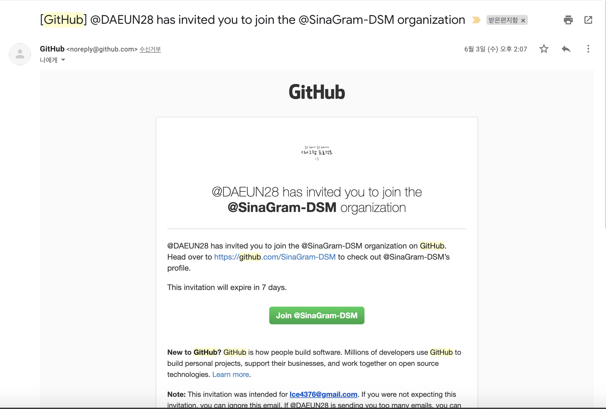

### 1-2. SinaGram-DSM/Tasting repository Fork하기

`fork`는 내 개인 계정이 아닌 다른 계정 혹은 organization의 repository를 나의 github repository에 그대로 복제하는 기능입니다. `fork`해 온 repository에서 생긴 변경 사항은 기존 repository에 적용되지 않습니다. 적용하기 위해서는 `Pull Request`를 날려야 하는데, 이는 우리가 `fork` 기능을 사용하는 이유입니다. `Pull Request`와 관련한 사항은 아래에서 이어서 설명하도록 하겠습니다!

1. 오른쪽 상단의 Fork 버튼을 클릭합니다.
   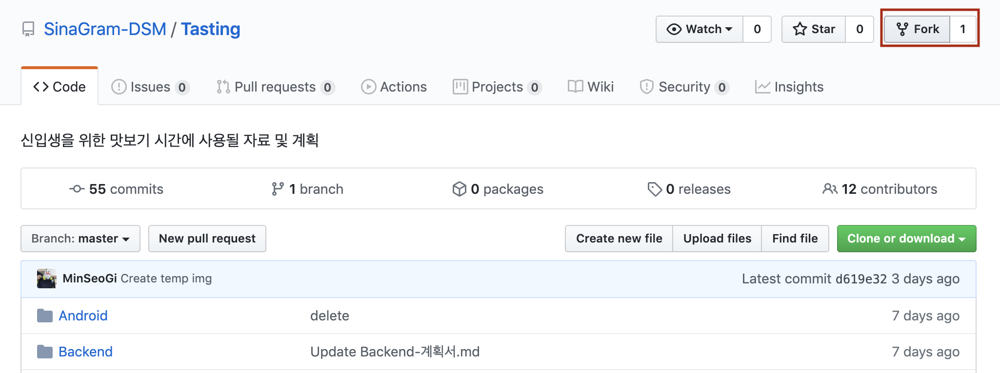
2. Fork할 계정을 선택합니다. 본인 계정을 선택해 주세요.
   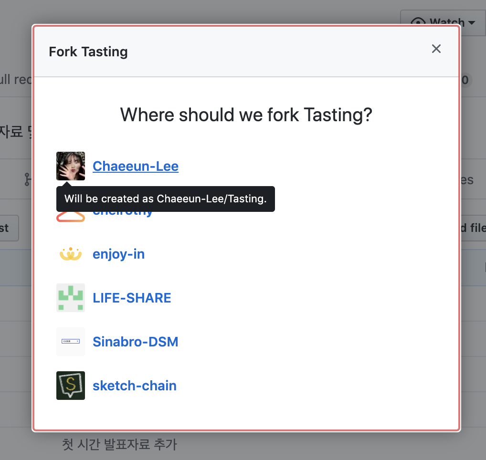
3. Fork되는 동안 표시되는 화면입니다.
   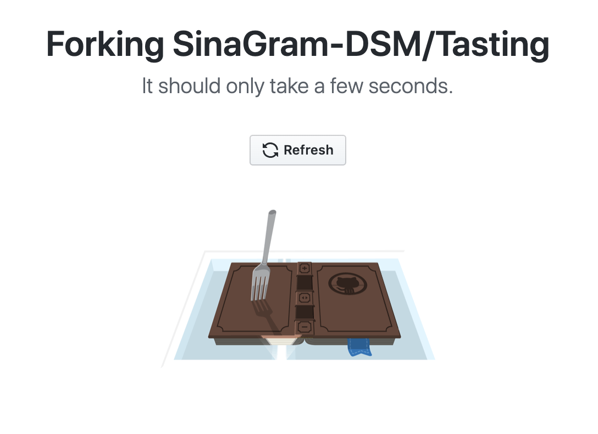

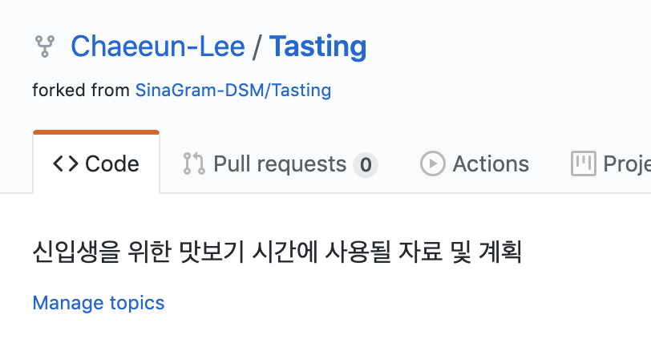

fork를 성공적으로 완료했습니다!

> Fork한 repository는 원본 repository와 바로 동기화되지 않습니다. 동기화하기 위해서는 다른 작업이 필요합니다. [이 링크를 참고하세요!](https://json.postype.com/post/210431)

### 1-3. Fork한 repository clone하기

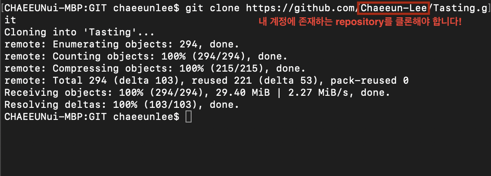

### 1-4. markdown으로 자기소개 페이지 계획하기

과제 2를 참고하세요!

### 1-5. 변경 사항 커밋하기

OT 때 배웠던 커밋하기가 기억나시나요? `git add *`와 `git commit -m "커밋 메시지"`를 사용하여 변경 사항을 커밋해 보세요. 꼭 CLI를 사용하지 않아도 됩니다! 원한다면 사용하고 싶은 GUI 툴을 사용하세요.

### 1-6. Pull Request 생성하기

`Pull Request`는 브랜치를 병합하거나, Fork해 온 repository로부터 기존 저장소에 변경 사항을 적용하고자 하는 경우 사용할 수 있습니다.

1. `New pull request`를 클릭해 PR(Pull Request) 생성을 시작합니다.
   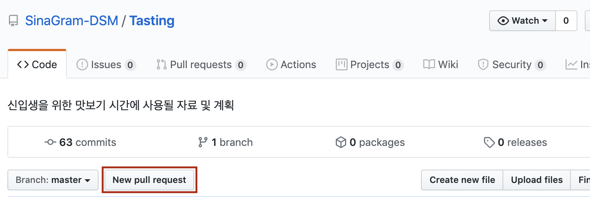
2. `compare across forks`를 클릭합니다.
   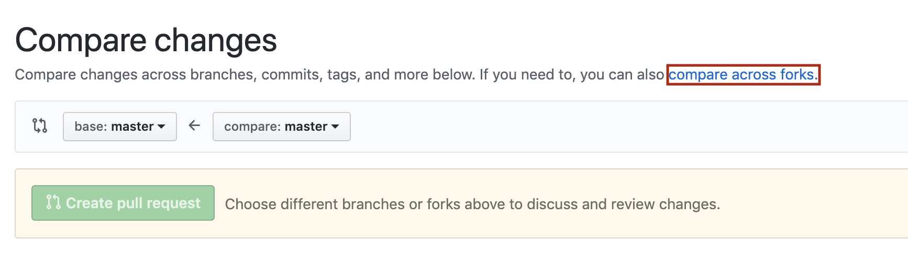
3. `head repository`를 내 계정에 존재하는 repository로 설정합니다.
   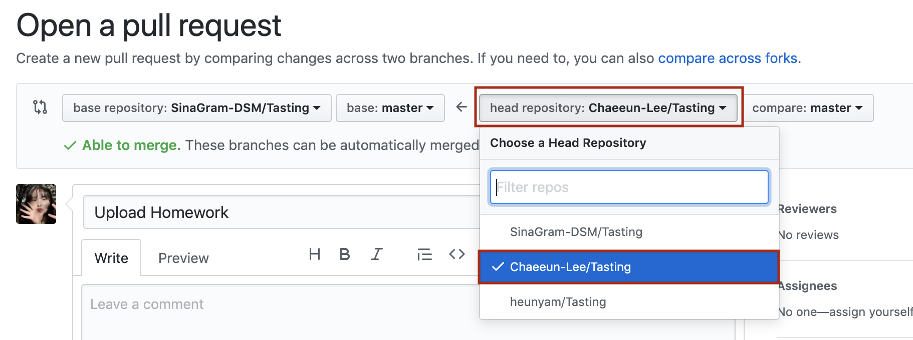
4. PR 제목과 내용을 작성합니다. 제목 형식은 `[이름] 과제명 과제 제출`입니다.
   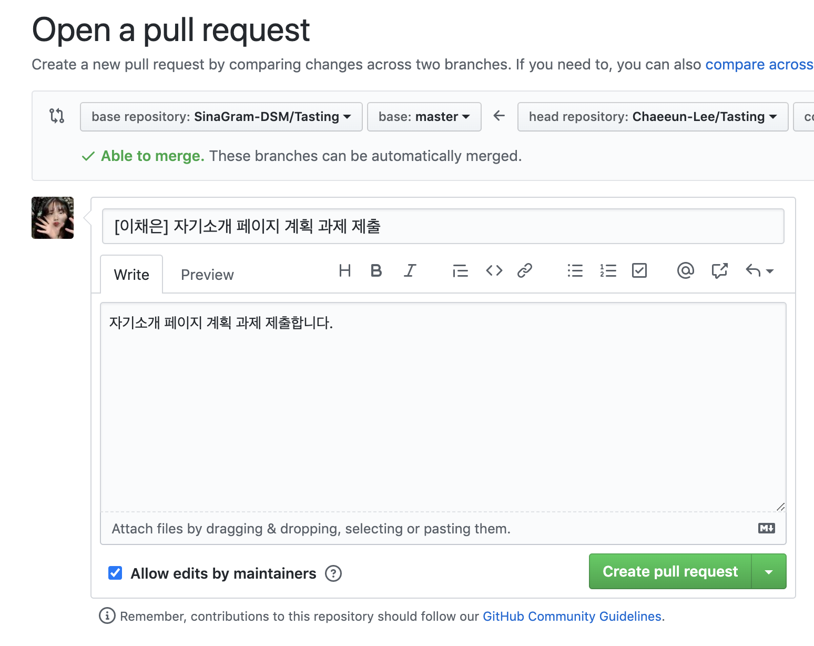
5. reviewers와 assignees를 선택합니다. 이번 과제의 reviewers와 assignees로는 김민석(`MinSeoGi`), 신서림(`S-rim`), 김다은(`DAEUN28`), 이채은(`Chaeeun-Lee`)을 선택해 주세요. 다 되었으면 PR을 등록합니다.
   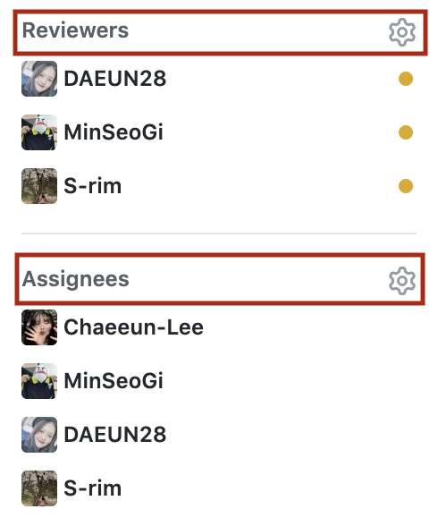
6. SinaGram-DSM/Tasting repository에서 Pull requests를 확인해 보세요. 방금 생성한 PR이 보일 거예요.
   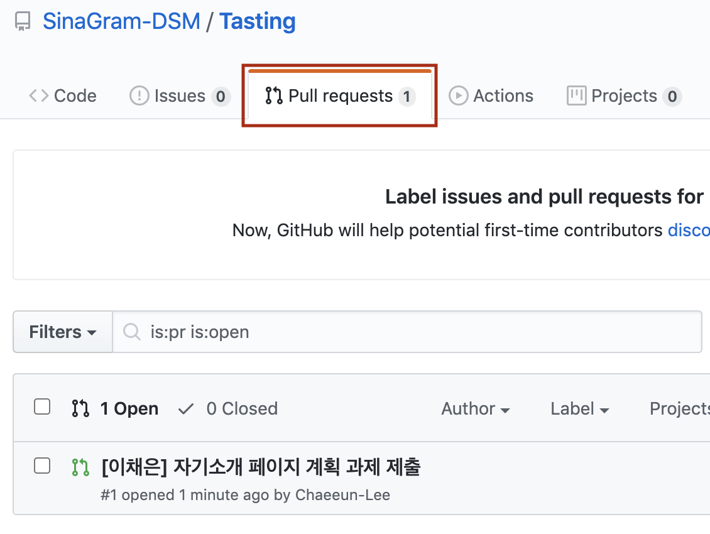

### 1-7. review 받기

선배들이 과제에 review를 달아 줄 거예요. 수시로 확인하면서 과제에 고쳐야 할 점이 있다면 고쳐 주세요!
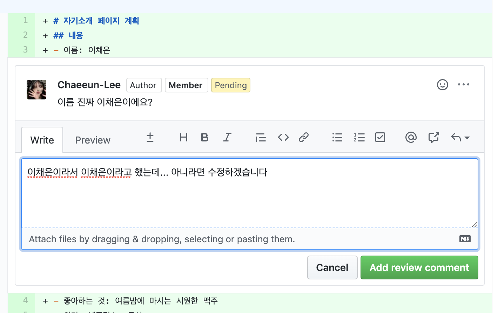

### 1-8. Merge하기

선배들이 모두 수락하면 Merge하세요.
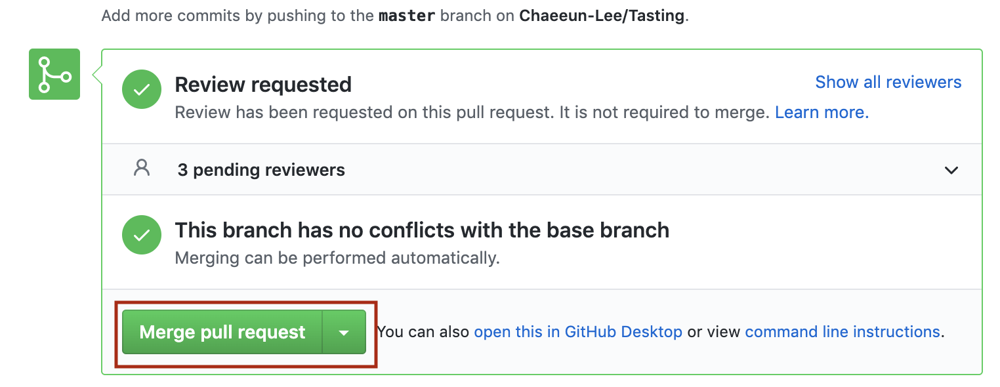

Merge가 완료되었습니다!
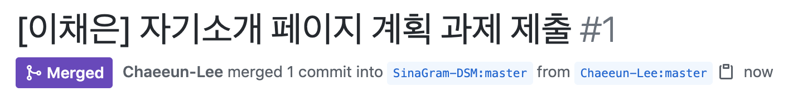

## 2. markdown

개발자라면 쓸 줄 알아야 하는 마크다운 사용해 보기! 디자인, 프론트엔드 시간에 만들게 될 자기소개 페이지를 간략하게 계획해 보세요. 어떤 내용이 들어가야 할지, 어떤 색을 사용할지! 복잡하지 않아도 괜찮습니다. 마크다운을 연습해 본다고 생각하고 작성해 주세요.

### 2-1. 마크다운으로 간략한 계획 작성하기

아래는 양식 예시입니다.

```
# 자기소개 페이지 계획
## 내용
- 이름
- 좋아하는 것
- 취미

## 하고 싶은 디자인
- 산뜻한 파스텔톤
- 친구와 같이 찍은 사진으로 배경 꾸미기
```

### 2-2. UserName/Tasting repository의 Homework 폴더 확인

1에서 Fork한 repository의 Homework 폴더를 확인하세요. 나와 있는 안내대로 마크다운 파일을 저장하고, 다시 과제 1로 돌아가 변경 사항을 적용합니다.

> 참고 링크: [MarkDown 문법 정리](https://heropy.blog/2017/09/30/markdown/)
